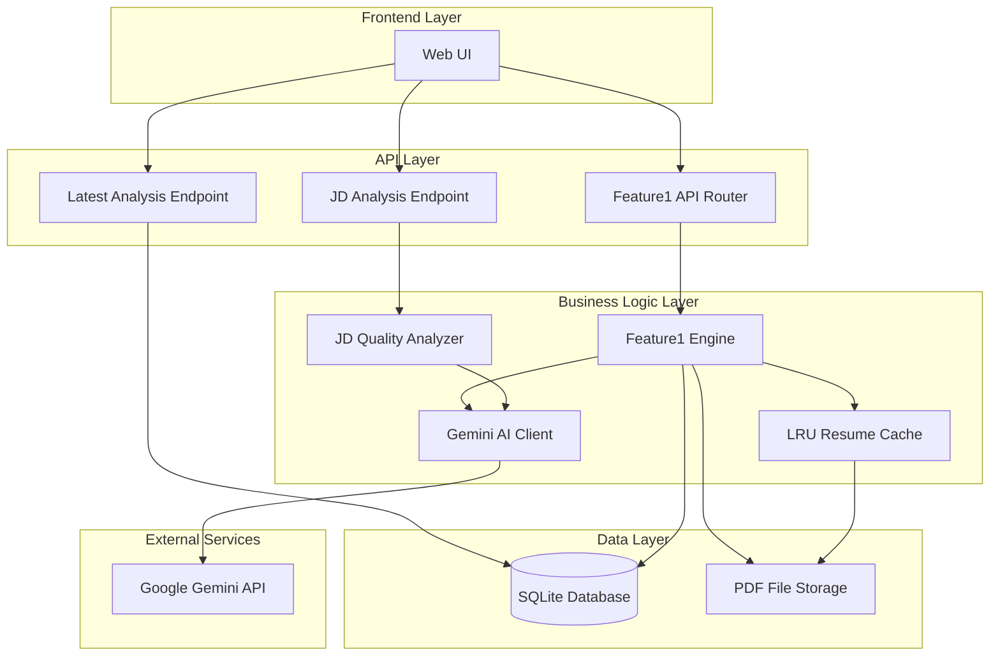

# Design Document: Feature 1 Lens Engine Hardening

## Overview

This design document specifies the technical implementation for Feature 1 Lens Engine Hardening enhancements. The system builds upon the existing Hiring Manager's Lens resume analysis engine to add five key capabilities: Gemini-powered AI recommendations, job description quality analysis, raw resume text persistence, latest analysis shortcuts, and resume text caching.

The enhancements integrate seamlessly with the existing Feature 1 architecture while maintaining backward compatibility and adding robust error handling for external AI service dependencies.

## Architecture

### System Context

The Feature 1 Lens Engine Hardening operates within the existing Career OS backend architecture:



### Component Integration

The hardening enhancements integrate with existing components:

1. **Feature1Engine**: Enhanced with Gemini integration and caching
2. **Database Models**: Extended with new fields for AI recommendations and raw text
3. **API Endpoints**: New endpoints for JD analysis and latest analysis retrieval
4. **Caching Layer**: New LRU cache for PDF parsing optimization

## Components and Interfaces

### 1. Gemini AI Client Enhancement

**Purpose**: Provides natural language coaching recommendations using Google's Gemini API.

**Interface**:
```python
class GeminiClient:
    def is_available() -> bool
    def generate(prompt: str, temperature: float = 0.4, max_tokens: int = 1024) -> str
    def generate_json(prompt: str, temperature: float = 0.2, max_tokens: int = 2048) -> str
```

**Key Features**:
- Non-blocking best-effort calls with graceful fallback
- Configurable temperature and token limits
- JSON response parsing capability
- Timeout handling (20 seconds)

### 2. Job Description Quality Analyzer

**Purpose**: Analyzes job description quality before resume processing to optimize semantic matching.

**Interface**:
```python
def score_job_description(jd_text: str) -> Dict[str, Any]:
    # Returns: quality_score, grade, word_count, skill_hits, issues, ai_feedback
```

**Scoring Algorithm**:
- Base score: 100 points
- Length penalty: -30 points for <80 words, -15 points for <150 words
- Skill detection: -20 points for <3 technical skills
- Structure penalty: -15 points for missing responsibilities section
- Seniority penalty: -10 points for missing experience requirements

**Grade Mapping**:
- Excellent: 85-100 points
- Good: 65-84 points  
- Fair: 45-64 points
- Poor: 0-44 points

### 3. Resume Text Caching System

**Purpose**: Implements LRU caching for PDF parsing to avoid redundant processing.

**Interface**:
```python
@lru_cache(maxsize=10)
def _cached_resume_text(resume_path_str: str) -> tuple[str, tuple]:
    # Returns: (extracted_text, layout_blocks_tuple)

def _get_resume_text_and_blocks(resume_path: Path) -> tuple[str, List[Dict]]:
    # Wrapper that converts cached tuple back to usable format
```

**Cache Strategy**:
- LRU eviction with 10-entry maximum
- Key: Resume file path string
- Value: Tuple of (text, serialized layout blocks)
- Transparent to existing Feature1Engine functionality

### 4. Enhanced Feature1Engine

**Purpose**: Integrates all hardening enhancements while maintaining existing functionality.

**New Methods**:
```python
def _gemini_recommendations(
    self, 
    resume_text: str, 
    heuristic_recs: List[str], 
    scores: Dict[str, float]
) -> List[str]:
    # Converts heuristic recommendations to natural language coaching
```

**Enhanced Output**:
- Adds `ai_recommendations` field to analysis results
- Adds `raw_resume_text` field (truncated to 8000 characters)
- Maintains backward compatibility with existing response format

## Data Models

### Database Schema Modifications

The existing `Feature1Analysis` model is enhanced with new fields:

```python
class Feature1Analysis(SQLModel, table=True):
    # ... existing fields ...
    
    # New fields for hardening enhancements
    ai_recommendations_json: str = Field(default="[]")  # Gemini coaching recommendations
    raw_resume_text: str = Field(default="")            # Raw text for cross-feature reuse
```

**Migration Strategy**:
- New fields have default values for backward compatibility
- Existing analyses continue to function without modification
- New analyses populate all fields automatically

### API Schema Extensions

New request/response schemas for enhanced functionality:

```python
class JDAnalyzeRequest(BaseModel):
    jd_text: str = Field(min_length=1, max_length=10000)

class JDAnalyzeResponse(BaseModel):
    quality_score: int                  # 0-100
    grade: str                          # excellent/good/fair/poor
    word_count: int
    skill_hits: List[str]               # recognized technical skills
    issues: List[str]                   # heuristic issues detected
    ai_feedback: str = ""               # Gemini 2-sentence critique

class Feature1AnalysisResponse(BaseModel):
    # ... existing fields ...
    ai_recommendations: List[str] = []   # New Gemini coaching field
```

## Error Handling

### Graceful Degradation Strategy

The system implements comprehensive error handling to ensure core functionality remains available when external dependencies fail:

**Gemini API Failures**:
- Connection timeouts (20 seconds)
- HTTP error responses (4xx, 5xx)
- Invalid JSON responses
- Rate limiting exceeded

**Fallback Behavior**:
- AI recommendations: Return empty list, continue with heuristic recommendations
- JD analysis: Return basic scoring without AI feedback
- Resume analysis: Complete processing without AI enhancements

**Error Logging**:
```python
# Log failures for monitoring without exposing to users
logging.getLogger("career_os").error("Gemini API failure: %s", error_details)
```

### Cache Error Handling

**Cache Operation Failures**:
- Memory allocation errors
- Serialization/deserialization failures
- LRU eviction errors

**Fallback Strategy**:
- Fall back to direct PDF parsing
- Log cache failures for monitoring
- Continue processing without performance optimization

### Input Validation

**PDF Upload Validation**:
- File size limit: 5MB maximum
- File type validation: PDF only
- Content validation: Readable PDF structure

**Job Description Validation**:
- Length limits: 1-10,000 characters
- Content sanitization: Remove potentially harmful content
- Encoding validation: UTF-8 compliance

## Correctness Properties

*A property is a characteristic or behavior that should hold true across all valid executions of a system-essentially, a formal statement about what the system should do. Properties serve as the bridge between human-readable specifications and machine-verifiable correctness guarantees.*

### Property 1: AI Recommendation Limit Enforcement

*For any* Gemini API response containing coaching recommendations, the system SHALL parse and return at most 5 coaching points regardless of the input length or format.

**Validates: Requirements 1.3**

### Property 2: Gemini API Configuration Consistency

*For any* AI recommendation request, the system SHALL use temperature 0.3 and maximum 400 tokens to ensure consistent, focused output.

**Validates: Requirements 1.6**

### Property 3: Database Persistence Completeness

*For any* analysis result containing both heuristic and AI recommendations, the system SHALL store both recommendation sets separately in the database with proper field mapping.

**Validates: Requirements 1.5**

### Property 4: JD Quality Score Range Validation

*For any* job description input, the quality analyzer SHALL return a score in the range 0-100 and assign the correct grade ("excellent", "good", "fair", or "poor") based on defined thresholds.

**Validates: Requirements 2.2, 2.3**

### Property 5: JD Scoring Rule Application

*For any* job description with fewer than 80 words or fewer than 3 technical skills, the system SHALL apply the appropriate point deductions (30 points for length, 20 points for skills) and include relevant recommendations.

**Validates: Requirements 2.4, 2.5**

### Property 6: Technical Skill Detection Accuracy

*For any* job description containing recognizable technical skills from the defined pattern set, the system SHALL detect and count all matching skills correctly.

**Validates: Requirements 2.6**

### Property 7: Resume Text Truncation Consistency

*For any* resume text exceeding 8000 characters, the system SHALL truncate to exactly the first 8000 characters and store the result in the database raw_resume_text field.

**Validates: Requirements 3.2, 3.3**

### Property 8: Latest Analysis Version Retrieval

*For any* candidate with multiple analysis versions, the latest analysis endpoint SHALL return the analysis record with the highest version number for that candidate.

**Validates: Requirements 4.2**

### Property 9: API Response Format Consistency

*For any* analysis data, the latest analysis endpoint SHALL return a response format identical to the existing analysis retrieval endpoint.

**Validates: Requirements 4.4**

### Property 10: LRU Cache Eviction Behavior

*For any* sequence of cache operations exceeding 10 entries, the cache SHALL evict the least recently used entry when adding new entries, maintaining exactly 10 entries maximum.

**Validates: Requirements 5.1, 5.4**

### Property 11: Cache Lookup Priority

*For any* resume PDF parsing request, the system SHALL check the cache first using the file path as key before attempting fresh PDF parsing.

**Validates: Requirements 5.2**

### Property 12: Cache Hit Data Return

*For any* cached resume entry, the system SHALL return the cached text and layout blocks without re-parsing the PDF file.

**Validates: Requirements 5.3**

### Property 13: Cache Data Structure Completeness

*For any* PDF processing result, the cache SHALL store both extracted text and layout blocks as a complete tuple preserving all processing metadata.

**Validates: Requirements 5.5**

### Property 14: Cache Round-Trip Consistency

*For any* PDF file, parsing from cache SHALL produce identical results to fresh parsing, including character-for-character text matching and complete layout block structure preservation.

**Validates: Requirements 6.1, 6.2, 6.3, 6.5**

### Property 15: Error Response Validation

*For any* invalid job description input, the system SHALL return appropriate HTTP error codes with descriptive error messages that don't expose internal system details.

**Validates: Requirements 7.2, 7.4**

## Testing Strategy

### Dual Testing Approach

**Unit Tests**: Verify specific examples, edge cases, and error conditions
- Gemini API integration with mocked responses
- JD quality analyzer with boundary conditions
- Cache functionality with memory constraints
- Error handling paths with simulated failures

**Property Tests**: Verify universal properties across all inputs
- Minimum 100 iterations per property test
- Each property test references its design document property
- Tag format: **Feature: feature1-lens-hardening, Property {number}: {property_text}**

### Property-Based Testing Configuration

**Test Library**: Use pytest-hypothesis for Python property-based testing
**Test Requirements**:
- Each correctness property implemented as a single property-based test
- 100+ iterations per test to ensure comprehensive input coverage
- Proper generators for resume text, job descriptions, and analysis data
- Mocked external services (Gemini API) for consistent testing

### Integration Testing

**External Service Integration**:
- Gemini API integration with real/mocked responses
- Database persistence with test fixtures
- File system operations with temporary directories
- Error simulation for external service failures

### Test Categories

- **Happy path**: All services available and functioning
- **Degraded mode**: Gemini unavailable, cache failures
- **Edge cases**: Empty inputs, malformed data, boundary conditions
- **Performance**: Cache effectiveness and response times

### Test Configuration

**Unit Test Requirements**:
- Mock Gemini API responses for consistent testing
- In-memory database for isolated test runs
- Temporary file system for PDF processing tests
- Configurable timeouts for external service simulation

**Integration Test Requirements**:
- Test environment with controlled Gemini API access
- Sample PDF files with known characteristics
- Database fixtures with existing analysis data
- Performance benchmarks for cache effectiveness

## Implementation Plan

### Phase 1: Core Infrastructure (Week 1)

1. **Gemini Client Enhancement**
   - Implement robust error handling and timeouts
   - Add JSON response parsing capability
   - Create comprehensive test suite with mocked responses

2. **Database Schema Migration**
   - Add new fields to Feature1Analysis model
   - Ensure backward compatibility with existing data
   - Create migration scripts for production deployment

### Phase 2: Analysis Engine Integration (Week 2)

1. **Feature1Engine Enhancement**
   - Integrate Gemini recommendations generation
   - Implement raw text persistence with truncation
   - Add comprehensive error handling for AI service failures

2. **Resume Caching System**
   - Implement LRU cache with proper serialization
   - Add cache hit/miss metrics for monitoring
   - Ensure thread safety for concurrent requests

### Phase 3: API Endpoints (Week 3)

1. **JD Quality Analysis Endpoint**
   - Implement scoring algorithm with technical skill detection
   - Add Gemini-powered feedback generation
   - Create comprehensive input validation

2. **Latest Analysis Shortcut**
   - Implement efficient database query with proper indexing
   - Add error handling for missing data scenarios
   - Ensure consistent response format with existing endpoints

### Phase 4: Testing and Optimization (Week 4)

1. **Comprehensive Testing**
   - Unit tests for all new components
   - Integration tests with mocked external services
   - Performance testing for cache effectiveness

2. **Production Readiness**
   - Monitoring and alerting for external service failures
   - Performance optimization based on test results
   - Documentation and deployment procedures

## Deployment Considerations

### Environment Configuration

**Required Environment Variables**:
```bash
GEMINI_API_KEY=your_gemini_api_key_here
# or alternatively
GOOGLE_API_KEY=your_google_api_key_here
```

**Optional Configuration**:
- Gemini API timeout settings
- Cache size configuration
- Error logging levels

### Monitoring and Observability

**Key Metrics**:
- Gemini API success/failure rates
- Cache hit/miss ratios
- PDF processing performance
- Analysis completion times

**Alerting Thresholds**:
- Gemini API failure rate >10% over 5 minutes
- Cache miss rate >80% (indicates potential issues)
- Analysis processing time >30 seconds

### Backward Compatibility

**API Compatibility**:
- All existing endpoints maintain identical response formats
- New fields are optional and have sensible defaults
- Existing client applications continue to function without modification

**Database Compatibility**:
- New fields have default values
- Existing data remains accessible
- Migration is non-destructive and reversible

## Security Considerations

### API Key Management

**Gemini API Key Security**:
- Store in environment variables, never in code
- Use least-privilege API key permissions
- Implement key rotation procedures
- Monitor API usage for anomalies

### Input Sanitization

**PDF Upload Security**:
- File size limits to prevent DoS attacks
- File type validation to prevent malicious uploads
- Sandboxed PDF processing to prevent code execution
- Temporary file cleanup to prevent disk exhaustion

**Job Description Input**:
- Length limits to prevent resource exhaustion
- Content sanitization to prevent injection attacks
- Rate limiting to prevent abuse

### Data Privacy

**Resume Text Storage**:
- Raw resume text truncated to 8000 characters
- No sensitive information logged in error messages
- Secure deletion of temporary files
- Compliance with data retention policies

## Performance Optimization

### Caching Strategy

**LRU Cache Benefits**:
- Reduces PDF parsing overhead by up to 90% for repeated requests
- Improves response times for version comparisons
- Minimizes memory usage with bounded cache size

**Cache Warming**:
- Pre-populate cache with frequently accessed resumes
- Implement background cache refresh for stale entries
- Monitor cache effectiveness with hit/miss metrics

### Database Optimization

**Query Performance**:
- Proper indexing on candidate_id and version_number fields
- Efficient latest analysis retrieval with ORDER BY optimization
- Connection pooling for concurrent request handling

### External Service Optimization

**Gemini API Efficiency**:
- Optimized prompts to minimize token usage
- Appropriate temperature settings for consistent results
- Request batching where applicable
- Circuit breaker pattern for service failures

## Conclusion

The Feature 1 Lens Engine Hardening design provides a robust, scalable enhancement to the existing resume analysis system. The implementation maintains backward compatibility while adding significant value through AI-powered recommendations, improved job description analysis, and performance optimizations.

The design emphasizes graceful degradation and error handling to ensure system reliability even when external dependencies are unavailable. The modular architecture allows for independent testing and deployment of individual components while maintaining system cohesion.