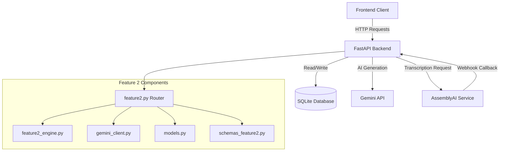
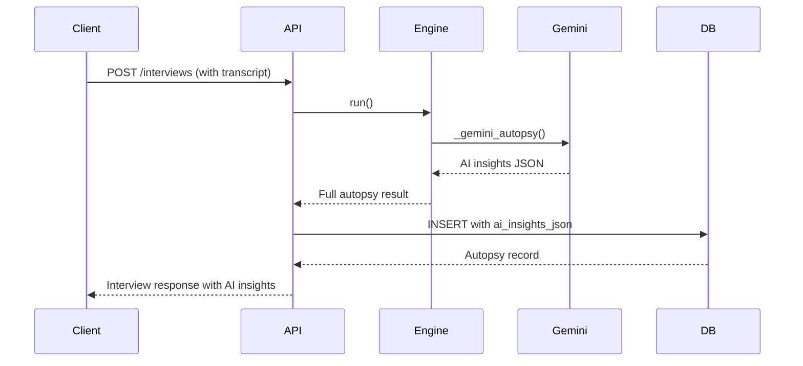
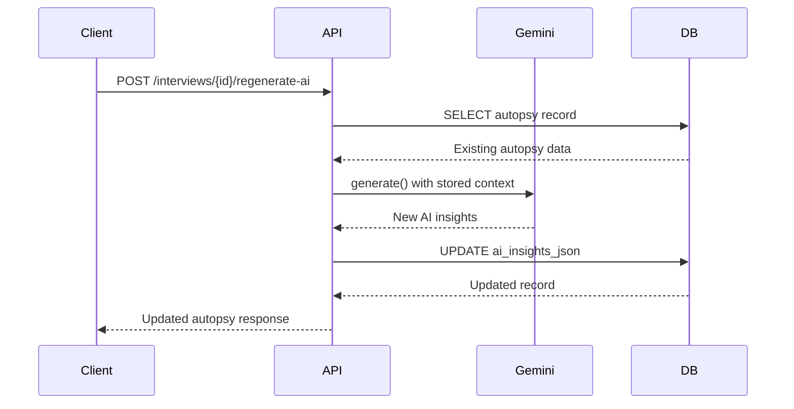
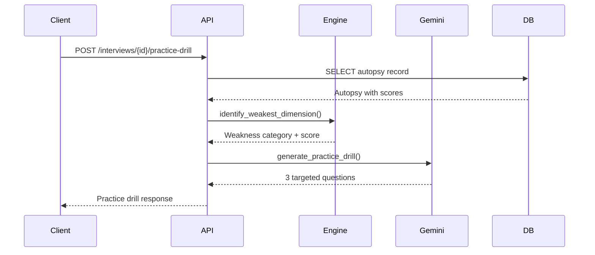
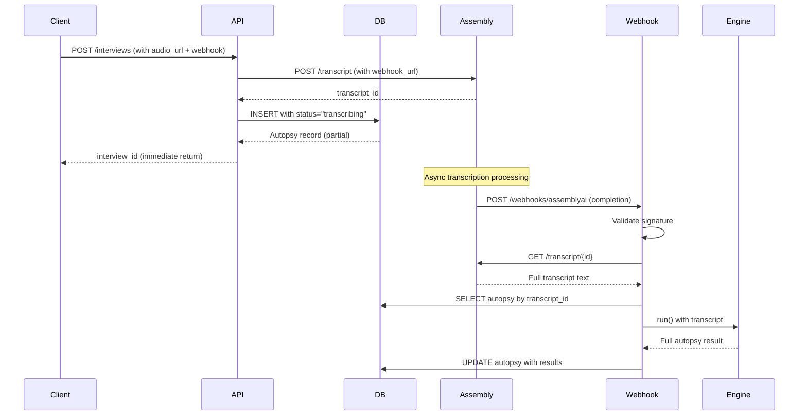
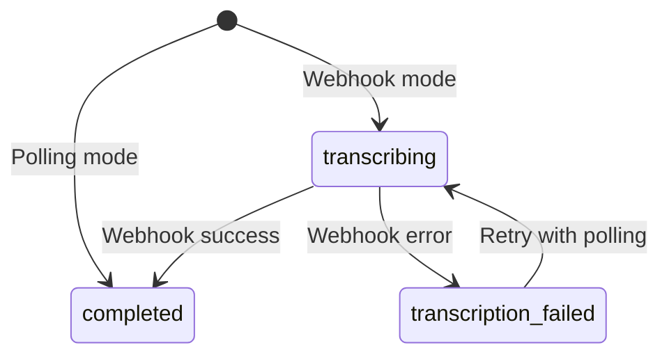

# Design Document: Feature 2 Rebound Hardening

## Overview

This design document specifies the technical implementation for six enhancements to the existing Feature 2 Interview Rebound system. The enhancements add AI insights persistence, AI regeneration capabilities, practice drill generation, webhook-based transcription, interview date tracking, and company stage context. These improvements build upon the existing Feature2_Engine, Gemini_Client integration, and AssemblyAI transcription infrastructure.

### Design Goals

1. **Persistence**: Store Gemini AI insights in the database for retrieval without re-computation
2. **Regeneration**: Enable on-demand AI insight refresh for existing interviews
3. **Practice Drills**: Generate targeted practice questions based on autopsy weaknesses
4. **Async Transcription**: Replace blocking polling with webhook-based transcription for scalability
5. **Temporal Context**: Track actual interview dates for accurate trend analysis
6. **Company Context**: Adjust scoring based on company stage (startup/scaleup/enterprise)
7. **Backward Compatibility**: Maintain existing API contracts while adding new capabilities

### Key Design Decisions

- **Database-First Approach**: New fields (interview_date, company_stage, ai_insights_json) are added to the existing Feature2InterviewAutopsy model rather than creating new tables
- **Webhook Architecture**: AssemblyAI webhooks are handled through a dedicated endpoint with signature validation, while maintaining the existing polling flow as a fallback
- **Gemini Integration Pattern**: All new AI endpoints follow the existing pattern in gemini_client.py with graceful degradation when unavailable
- **Migration Strategy**: Idempotent migration script with sensible defaults for existing records


## Architecture

### System Context

The Feature 2 Rebound Hardening enhancements integrate with the existing Career OS architecture:



### Component Responsibilities

#### 1. Database Layer (models.py)
- **Feature2InterviewAutopsy**: Extended with `interview_date`, `company_stage`, and enhanced `ai_insights_json`
- **Migration Script**: Adds new columns with indexes and default values

#### 2. API Layer (api/feature2.py)
- **Existing Endpoints**: Enhanced to include new fields in responses
- **New Endpoints**:
  - `POST /api/feature2/interviews/{id}/regenerate-ai`: Regenerate AI insights
  - `POST /api/feature2/interviews/{id}/practice-drill`: Generate practice questions
  - `POST /api/feature2/webhooks/assemblyai`: Handle transcription webhooks

#### 3. Analysis Engine (analysis/feature2_engine.py)
- **Company Stage Scoring**: Adjust culture_vibe_score based on company_stage parameter
- **Weakness Identification**: New method to identify lowest scoring dimension for practice drills

#### 4. AI Client (analysis/gemini_client.py)
- **Regeneration Prompts**: Structured prompts for re-running autopsy insights
- **Practice Drill Generation**: Prompts tailored to technical/behavioral/strategic weaknesses

### Data Flow Diagrams

#### AI Insights Persistence Flow


#### AI Regeneration Flow


#### Practice Drill Flow


#### Webhook Transcription Flow



## Components and Interfaces

### 1. Database Schema Extensions

#### Feature2InterviewAutopsy Model Changes

```python
class Feature2InterviewAutopsy(SQLModel, table=True):
    # ... existing fields ...
    
    # NEW FIELDS
    interview_date: datetime = Field(
        default_factory=utc_now, 
        index=True,
        description="Actual interview date (distinct from created_at)"
    )
    company_stage: str = Field(
        default="scaleup",
        index=True,
        description="Company maturity: startup|scaleup|enterprise"
    )
    
    # ENHANCED FIELD
    ai_insights_json: str = Field(
        default="{}",
        description="Persisted Gemini autopsy with diagnosis, perfect_answer, week_plan, mindset"
    )
    
    # NEW FIELD FOR WEBHOOK SUPPORT
    transcription_status: str = Field(
        default="completed",
        index=True,
        description="Status: transcribing|completed|transcription_failed"
    )
    assembly_transcript_id: Optional[str] = Field(
        default=None,
        index=True,
        description="AssemblyAI transcript ID for webhook correlation"
    )
```

#### Migration Script Structure

```python
# migrate_feature2_hardening.py

def migrate_feature2_hardening(db_path: str = "Backend/data/career_os.db"):
    """
    Idempotent migration to add interview_date, company_stage, 
    transcription_status, and assembly_transcript_id fields.
    """
    conn = sqlite3.connect(db_path)
    cursor = conn.cursor()
    
    # Check if columns already exist
    cursor.execute("PRAGMA table_info(feature2interviewautopsy)")
    columns = {row[1] for row in cursor.fetchall()}
    
    # Add interview_date column
    if "interview_date" not in columns:
        cursor.execute("""
            ALTER TABLE feature2interviewautopsy 
            ADD COLUMN interview_date TEXT NOT NULL DEFAULT (datetime('now'))
        """)
        # Backfill with created_at for existing records
        cursor.execute("""
            UPDATE feature2interviewautopsy 
            SET interview_date = created_at 
            WHERE interview_date = datetime('now')
        """)
    
    # Add company_stage column
    if "company_stage" not in columns:
        cursor.execute("""
            ALTER TABLE feature2interviewautopsy 
            ADD COLUMN company_stage TEXT NOT NULL DEFAULT 'scaleup'
        """)
    
    # Add transcription_status column
    if "transcription_status" not in columns:
        cursor.execute("""
            ALTER TABLE feature2interviewautopsy 
            ADD COLUMN transcription_status TEXT NOT NULL DEFAULT 'completed'
        """)
    
    # Add assembly_transcript_id column
    if "assembly_transcript_id" not in columns:
        cursor.execute("""
            ALTER TABLE feature2interviewautopsy 
            ADD COLUMN assembly_transcript_id TEXT
        """)
    
    # Create indexes
    cursor.execute("""
        CREATE INDEX IF NOT EXISTS idx_feature2_interview_date 
        ON feature2interviewautopsy(interview_date)
    """)
    cursor.execute("""
        CREATE INDEX IF NOT EXISTS idx_feature2_company_stage 
        ON feature2interviewautopsy(company_stage)
    """)
    cursor.execute("""
        CREATE INDEX IF NOT EXISTS idx_feature2_transcription_status 
        ON feature2interviewautopsy(transcription_status)
    """)
    cursor.execute("""
        CREATE INDEX IF NOT EXISTS idx_feature2_assembly_transcript_id 
        ON feature2interviewautopsy(assembly_transcript_id)
    """)
    
    conn.commit()
    conn.close()
```

### 2. API Endpoints

#### 2.1 Enhanced Create Interview Endpoint

**Endpoint**: `POST /api/feature2/interviews`

**Request Schema Changes**:
```python
class Feature2CreateInterviewRequest(BaseModel):
    # ... existing fields ...
    
    # NEW FIELDS
    interview_date: Optional[datetime] = Field(
        default=None,
        description="Actual interview date (ISO 8601). Defaults to current date if omitted."
    )
    company_stage: str = Field(
        default="scaleup",
        description="Company maturity: startup|scaleup|enterprise"
    )
    webhook_url: Optional[str] = Field(
        default=None,
        description="Webhook URL for async transcription completion notification"
    )
```

**Response Schema Changes**:
```python
class Feature2InterviewResponse(BaseModel):
    # ... existing fields ...
    
    # NEW FIELDS
    interview_date: datetime
    company_stage: str
    transcription_status: str  # For webhook mode
    
    # ENHANCED FIELD
    ai_insights: Dict[str, Any] = {}  # Now always populated
```

**Implementation Notes**:
- If `interview_date` is None, default to `datetime.now(timezone.utc)`
- If `webhook_url` is provided with `assembly_audio_url`, use webhook mode
- In webhook mode, return immediately with `transcription_status="transcribing"`
- In polling mode (existing behavior), return with `transcription_status="completed"`

#### 2.2 AI Regeneration Endpoint

**Endpoint**: `POST /api/feature2/interviews/{interview_id}/regenerate-ai`

**Request**: No body required (uses stored autopsy data)

**Response**:
```python
class Feature2RegenerateAIResponse(BaseModel):
    interview_id: int
    ai_insights: Dict[str, Any]
    regenerated_at: datetime
```

**Error Responses**:
- `404 Not Found`: Interview ID does not exist
- `502 Bad Gateway`: Gemini API unavailable or failed

**Implementation**:
```python
@router.post("/interviews/{interview_id}/regenerate-ai")
def regenerate_ai_insights(
    interview_id: int, 
    session: Session = Depends(get_session)
):
    # 1. Retrieve existing autopsy
    row = session.get(Feature2InterviewAutopsy, interview_id)
    if row is None:
        raise HTTPException(status_code=404, detail="Interview not found")
    
    # 2. Check Gemini availability
    if not gemini_client.is_available():
        raise HTTPException(
            status_code=502, 
            detail="Gemini API unavailable. Check GEMINI_API_KEY configuration."
        )
    
    # 3. Reconstruct context from stored data
    ingestion = json.loads(row.ingestion_json)
    technical = json.loads(row.technical_json)
    behavioral = json.loads(row.behavioral_json)
    
    # 4. Generate new AI insights
    prompt = _build_regeneration_prompt(row, ingestion, technical, behavioral)
    raw_insights = gemini_client.generate(prompt, temperature=0.35, max_tokens=512)
    
    if not raw_insights:
        raise HTTPException(
            status_code=502,
            detail="Gemini API returned empty response"
        )
    
    # 5. Parse structured insights
    ai_insights = _parse_gemini_autopsy(raw_insights)
    
    # 6. Update database
    row.ai_insights_json = json.dumps(ai_insights, ensure_ascii=True)
    session.add(row)
    session.commit()
    session.refresh(row)
    
    return Feature2RegenerateAIResponse(
        interview_id=interview_id,
        ai_insights=ai_insights,
        regenerated_at=datetime.now(timezone.utc)
    )
```

#### 2.3 Practice Drill Endpoint

**Endpoint**: `POST /api/feature2/interviews/{interview_id}/practice-drill`

**Request**: No body required

**Response**:
```python
class Feature2PracticeDrillResponse(BaseModel):
    interview_id: int
    weakness_category: str  # "technical"|"behavioral"|"strategic"
    weakness_score: float
    questions: List[str]  # Exactly 3 questions
    generated_at: datetime
```

**Error Responses**:
- `404 Not Found`: Interview ID does not exist
- `502 Bad Gateway`: Gemini API unavailable or failed

**Implementation**:
```python
@router.post("/interviews/{interview_id}/practice-drill")
def generate_practice_drill(
    interview_id: int,
    session: Session = Depends(get_session)
):
    # 1. Retrieve autopsy
    row = session.get(Feature2InterviewAutopsy, interview_id)
    if row is None:
        raise HTTPException(status_code=404, detail="Interview not found")
    
    # 2. Check Gemini availability
    if not gemini_client.is_available():
        raise HTTPException(status_code=502, detail="Gemini API unavailable")
    
    # 3. Identify weakest dimension
    scores = json.loads(row.score_json)
    weakness = _identify_weakest_dimension(scores)
    
    # 4. Generate targeted questions
    prompt = _build_practice_drill_prompt(
        weakness_category=weakness["category"],
        weakness_score=weakness["score"],
        challenge_question=row.challenge_question,
        role_name=row.role_name
    )
    
    raw_response = gemini_client.generate(prompt, temperature=0.4, max_tokens=512)
    if not raw_response:
        raise HTTPException(status_code=502, detail="Gemini API failed")
    
    questions = _parse_practice_questions(raw_response)
    
    return Feature2PracticeDrillResponse(
        interview_id=interview_id,
        weakness_category=weakness["category"],
        weakness_score=weakness["score"],
        questions=questions,
        generated_at=datetime.now(timezone.utc)
    )

def _identify_weakest_dimension(scores: Dict[str, float]) -> Dict[str, Any]:
    """Identify the lowest scoring dimension for targeted practice."""
    dimensions = {
        "technical": scores["technical_accuracy"],
        "behavioral": scores["behavioral_quality"],
        "strategic": scores["strategic_recovery_readiness"]
    }
    weakest = min(dimensions.items(), key=lambda x: x[1])
    return {"category": weakest[0], "score": weakest[1]}
```

#### 2.4 AssemblyAI Webhook Endpoint

**Endpoint**: `POST /api/feature2/webhooks/assemblyai`

**Request Headers**:
- `X-AssemblyAI-Signature`: HMAC signature for validation

**Request Body** (from AssemblyAI):
```json
{
  "transcript_id": "abc123",
  "status": "completed",
  "text": "Full transcript text...",
  "error": null
}
```

**Response**: `200 OK` (minimal response, processing is async)

**Implementation**:
```python
@router.post("/webhooks/assemblyai")
async def assemblyai_webhook(
    request: Request,
    session: Session = Depends(get_session)
):
    # 1. Validate signature
    signature = request.headers.get("X-AssemblyAI-Signature", "")
    body_bytes = await request.body()
    
    if not _validate_assemblyai_signature(signature, body_bytes):
        raise HTTPException(status_code=401, detail="Invalid signature")
    
    # 2. Parse webhook payload
    payload = json.loads(body_bytes)
    transcript_id = payload.get("transcript_id")
    status = payload.get("status")
    
    # 3. Find pending autopsy record
    stmt = select(Feature2InterviewAutopsy).where(
        Feature2InterviewAutopsy.assembly_transcript_id == transcript_id
    )
    row = session.exec(stmt).first()
    
    if row is None:
        logger.warning(f"Webhook received for unknown transcript_id: {transcript_id}")
        raise HTTPException(status_code=404, detail="Transcript not found")
    
    # 4. Handle completion
    if status == "completed":
        transcript_text = payload.get("text", "")
        
        # Run full analysis
        engine = _create_engine_from_row(row, transcript_text)
        result = engine.run()
        
        # Update record
        row.transcription_status = "completed"
        row.raw_transcript_excerpt = transcript_text[:2000]
        row.ingestion_json = json.dumps(result["ingestion"])
        row.technical_json = json.dumps(result["technical"])
        row.behavioral_json = json.dumps(result["behavioral"])
        row.strategic_actions_json = json.dumps(result["strategic_actions"])
        row.score_json = json.dumps(result["score"])
        row.analytics_snapshot_json = json.dumps(result["analytics_snapshot"])
        row.ai_insights_json = json.dumps(result.get("ai_insights", {}))
        
    elif status == "error":
        row.transcription_status = "transcription_failed"
        error_msg = payload.get("error", "Unknown error")
        # Store error in a metadata field or log
        logger.error(f"Transcription failed for {transcript_id}: {error_msg}")
    
    session.add(row)
    session.commit()
    
    return {"status": "processed"}

def _validate_assemblyai_signature(signature: str, body: bytes) -> bool:
    """Validate HMAC signature from AssemblyAI webhook."""
    secret = os.getenv("ASSEMBLYAI_WEBHOOK_SECRET", "").strip()
    if not secret:
        logger.warning("ASSEMBLYAI_WEBHOOK_SECRET not configured")
        return False
    
    import hmac
    import hashlib
    
    expected = hmac.new(
        secret.encode(),
        body,
        hashlib.sha256
    ).hexdigest()
    
    return hmac.compare_digest(signature, expected)
```

### 3. Analysis Engine Extensions

#### Company Stage Scoring Adjustment

```python
# In feature2_engine.py

def _culture_vibe_score(
    self, 
    vibe: str, 
    friendliness: int,
    company_stage: str = "scaleup"
) -> float:
    """
    Calculate culture vibe score with company stage adjustment.
    
    Adjustments:
    - startup: +10 points (higher tolerance for informal culture)
    - enterprise: +10 points for structured process expectations
    """
    vibe_bias = {
        "friendly": 20,
        "neutral": 0,
        "cold": -10,
        "hostile": -20,
    }.get(vibe, 0)
    
    base_score = 50 + vibe_bias + friendliness * 4
    
    # Company stage adjustments
    if company_stage == "startup":
        # Startups: increase tolerance for informal/chaotic culture
        if vibe in ["neutral", "cold"]:
            base_score += 10
    elif company_stage == "enterprise":
        # Enterprise: increase expectations for structured process
        if vibe in ["friendly", "neutral"]:
            base_score += 10
    
    return float(max(0, min(100, base_score)))
```

### 4. Gemini Client Extensions

#### Prompt Templates

```python
# In gemini_client.py or feature2_engine.py

def _build_regeneration_prompt(
    row: Feature2InterviewAutopsy,
    ingestion: Dict,
    technical: Dict,
    behavioral: Dict
) -> str:
    """Build prompt for AI insights regeneration."""
    return f"""You are a senior engineering interview coach. Analyze this interview debrief:

Interview round: {row.interview_round}
Company: {row.company_name} ({row.company_stage})
Role: {row.role_name}
Outcome: {row.interview_outcome}
Hardest question: {ingestion.get('challenge_question', 'unknown')}
Technical score: {technical.get('score', 0):.1f}/100
Behavioral score: {behavioral.get('score', 0):.1f}/100

Transcript excerpt:
\"\"\"{row.raw_transcript_excerpt[:1500]}\"\"\"

Provide a structured coaching response with these exact sections:
DIAGNOSIS: (2 sentences on root cause of weak performance)
PERFECT_ANSWER: (ideal 3-sentence answer to the hardest question)
WEEK_PLAN: (3 specific daily actions for the next 3 days)
MINDSET: (1 sentence reframe to build resilience)

Keep each section concise and actionable."""

def _build_practice_drill_prompt(
    weakness_category: str,
    weakness_score: float,
    challenge_question: str,
    role_name: str
) -> str:
    """Build prompt for practice drill generation."""
    
    if weakness_category == "technical":
        focus = "technical depth, system design trade-offs, and quantitative reasoning"
        format_hint = "Focus on architecture, scalability, and implementation details."
    elif weakness_category == "behavioral":
        focus = "STAR-format storytelling, impact quantification, and collaboration"
        format_hint = "Use STAR format: Situation, Task, Action, Result with metrics."
    else:  # strategic
        focus = "follow-up strategy, negotiation, and resilience"
        format_hint = "Focus on recovery tactics, clarification, and positioning."
    
    return f"""You are an expert interview coach. Generate exactly 3 practice questions to improve {weakness_category} skills.

Context:
- Role: {role_name}
- Weakness: {weakness_category} (score: {weakness_score:.1f}/100)
- Recent challenge: {challenge_question}
- Focus areas: {focus}

Requirements:
1. Generate exactly 3 questions
2. {format_hint}
3. Questions should be progressively challenging
4. Each question should be realistic for a {role_name} interview

Format your response as:
QUESTION 1: [question text]
QUESTION 2: [question text]
QUESTION 3: [question text]"""
```


## Data Models

### Request/Response Schemas

#### Enhanced Interview Creation
```python
# schemas_feature2.py additions

class Feature2CreateInterviewRequest(BaseModel):
    # ... existing fields ...
    interview_date: Optional[datetime] = None
    company_stage: str = Field(default="scaleup", pattern="^(startup|scaleup|enterprise)$")
    webhook_url: Optional[str] = None

class Feature2InterviewResponse(BaseModel):
    # ... existing fields ...
    interview_date: datetime
    company_stage: str
    transcription_status: str
    ai_insights: Dict[str, Any] = {}
```

#### New Response Schemas
```python
class Feature2RegenerateAIResponse(BaseModel):
    interview_id: int
    ai_insights: Dict[str, Any]
    regenerated_at: datetime

class Feature2PracticeDrillResponse(BaseModel):
    interview_id: int
    weakness_category: str
    weakness_score: float
    questions: List[str]
    generated_at: datetime

class Feature2WebhookPayload(BaseModel):
    """AssemblyAI webhook payload structure."""
    transcript_id: str
    status: str  # "completed" | "error"
    text: Optional[str] = None
    error: Optional[str] = None
```

### AI Insights JSON Structure

The `ai_insights_json` field stores structured coaching data:

```json
{
  "diagnosis": "Root cause analysis in 2 sentences",
  "perfect_answer": "Ideal 3-sentence response to hardest question",
  "week_plan": "3 specific daily actions for next 3 days",
  "mindset": "1 sentence resilience reframe"
}
```

**Empty State**: When Gemini is unavailable or no insights exist, the field contains `{}` (empty JSON object).

### Database Indexes

```sql
-- Performance indexes for new fields
CREATE INDEX idx_feature2_interview_date ON feature2interviewautopsy(interview_date);
CREATE INDEX idx_feature2_company_stage ON feature2interviewautopsy(company_stage);
CREATE INDEX idx_feature2_transcription_status ON feature2interviewautopsy(transcription_status);
CREATE INDEX idx_feature2_assembly_transcript_id ON feature2interviewautopsy(assembly_transcript_id);

-- Composite index for trend queries
CREATE INDEX idx_feature2_candidate_interview_date 
ON feature2interviewautopsy(candidate_id, interview_date);
```

### State Machine for Transcription Status



**States**:
- `transcribing`: Waiting for AssemblyAI webhook callback
- `completed`: Transcription and analysis finished
- `transcription_failed`: AssemblyAI reported error


## Error Handling

### Error Categories and Responses

#### 1. Database Errors

**Scenario**: Interview ID not found
```python
# HTTP 404 Not Found
{
  "detail": "Interview autopsy not found."
}
```

**Scenario**: Database connection failure
```python
# HTTP 500 Internal Server Error
{
  "detail": "Database operation failed. Please try again."
}
```

#### 2. External Service Errors

**Scenario**: Gemini API unavailable
```python
# HTTP 502 Bad Gateway
{
  "detail": "Gemini API unavailable. Check GEMINI_API_KEY configuration."
}
```

**Scenario**: Gemini API timeout
```python
# HTTP 504 Gateway Timeout
{
  "detail": "Gemini API request timed out after 20 seconds."
}
```

**Scenario**: AssemblyAI transcription failure
```python
# HTTP 502 Bad Gateway
{
  "detail": "AssemblyAI transcription error: [error message]"
}
```

#### 3. Webhook Security Errors

**Scenario**: Invalid webhook signature
```python
# HTTP 401 Unauthorized
{
  "detail": "Invalid signature"
}
```

**Scenario**: Webhook rate limit exceeded
```python
# HTTP 429 Too Many Requests
{
  "detail": "Rate limit exceeded. Maximum 100 requests per minute."
}
```

#### 4. Validation Errors

**Scenario**: Invalid company_stage value
```python
# HTTP 422 Unprocessable Entity
{
  "detail": [
    {
      "loc": ["body", "company_stage"],
      "msg": "value must be one of: startup, scaleup, enterprise",
      "type": "value_error.const"
    }
  ]
}
```

**Scenario**: Invalid interview_date format
```python
# HTTP 422 Unprocessable Entity
{
  "detail": [
    {
      "loc": ["body", "interview_date"],
      "msg": "invalid datetime format",
      "type": "value_error.datetime"
    }
  ]
}
```

### Error Handling Patterns

#### Graceful Degradation for AI Services

```python
def _safe_gemini_call(prompt: str, fallback: Dict[str, Any]) -> Dict[str, Any]:
    """
    Call Gemini with automatic fallback to empty/default response.
    Used for non-critical AI enhancements.
    """
    if not gemini_client.is_available():
        logger.warning("Gemini unavailable, using fallback")
        return fallback
    
    try:
        result = gemini_client.generate(prompt, temperature=0.35, max_tokens=512)
        if not result:
            logger.warning("Gemini returned empty response")
            return fallback
        return _parse_gemini_response(result)
    except Exception as e:
        logger.error(f"Gemini call failed: {e}")
        return fallback
```

#### Webhook Retry Logic

```python
def _handle_transcription_failure(
    row: Feature2InterviewAutopsy,
    session: Session
):
    """
    Fallback to polling-based transcription when webhook fails.
    """
    if row.transcription_status == "transcription_failed":
        logger.info(f"Retrying transcription for interview {row.id} with polling")
        
        # Attempt polling-based transcription
        try:
            transcript_text = _assemblyai_transcribe(
                audio_url=row.assembly_audio_url,  # Stored in metadata
                api_key=os.getenv("ASSEMBLYAI_API_KEY")
            )
            
            # Run analysis with retrieved transcript
            engine = _create_engine_from_row(row, transcript_text)
            result = engine.run()
            
            # Update record
            row.transcription_status = "completed"
            row.raw_transcript_excerpt = transcript_text[:2000]
            # ... update other fields ...
            
            session.add(row)
            session.commit()
            
        except Exception as e:
            logger.error(f"Polling fallback failed: {e}")
            # Keep status as transcription_failed
```

#### Rate Limiting for Webhooks

```python
from collections import defaultdict
from datetime import datetime, timedelta
import threading

# In-memory rate limiter (production should use Redis)
_webhook_rate_limits = defaultdict(list)
_rate_limit_lock = threading.Lock()

def _check_rate_limit(ip_address: str, max_requests: int = 100, window_seconds: int = 60) -> bool:
    """
    Check if IP address has exceeded rate limit.
    Returns True if request is allowed, False if rate limited.
    """
    with _rate_limit_lock:
        now = datetime.now()
        cutoff = now - timedelta(seconds=window_seconds)
        
        # Remove old requests
        _webhook_rate_limits[ip_address] = [
            ts for ts in _webhook_rate_limits[ip_address] 
            if ts > cutoff
        ]
        
        # Check limit
        if len(_webhook_rate_limits[ip_address]) >= max_requests:
            return False
        
        # Record this request
        _webhook_rate_limits[ip_address].append(now)
        return True

@router.post("/webhooks/assemblyai")
async def assemblyai_webhook(request: Request, session: Session = Depends(get_session)):
    # Rate limiting
    client_ip = request.client.host
    if not _check_rate_limit(client_ip):
        raise HTTPException(
            status_code=429,
            detail="Rate limit exceeded. Maximum 100 requests per minute."
        )
    
    # ... rest of webhook handler ...
```

### Logging Strategy

```python
import logging

logger = logging.getLogger("career_os.feature2")

# Log levels by scenario:
# - DEBUG: Detailed flow for development
# - INFO: Normal operations (webhook received, AI regenerated)
# - WARNING: Degraded mode (Gemini unavailable, using fallback)
# - ERROR: Failures requiring attention (webhook signature invalid, transcription failed)

# Example logging patterns:
logger.info(f"AI insights regenerated for interview {interview_id}")
logger.warning(f"Gemini unavailable, returning empty ai_insights for interview {interview_id}")
logger.error(f"Webhook signature validation failed from IP {client_ip}")
logger.debug(f"Practice drill generated: {weakness_category} with {len(questions)} questions")
```

### Backward Compatibility Guarantees

1. **Existing Endpoints**: All existing endpoints continue to work without modification
2. **Optional Fields**: New request fields (`interview_date`, `company_stage`, `webhook_url`) are optional with sensible defaults
3. **Response Extensions**: New response fields are added without removing existing fields
4. **Database Migration**: Existing records receive default values (`interview_date=created_at`, `company_stage="scaleup"`)
5. **AI Insights**: Empty `ai_insights` field returns `{}` instead of null for consistent client handling
6. **Polling Mode**: Existing polling-based transcription continues to work when `webhook_url` is not provided


## Testing Strategy

### Property-Based Testing Applicability Assessment

This feature involves:
- **Database schema migrations**: Adding columns with default values
- **API endpoint enhancements**: Adding optional fields to existing endpoints
- **External service integrations**: Gemini API calls, AssemblyAI webhooks
- **Webhook security**: Signature validation and rate limiting
- **Configuration and defaults**: Setting interview_date and company_stage defaults

**Assessment**: Property-based testing is **NOT appropriate** for this feature because:

1. **Infrastructure Changes**: Database migrations are declarative schema changes, not functions with testable properties
2. **External Service Integration**: Gemini and AssemblyAI interactions are I/O-bound operations with external dependencies
3. **Webhook Handling**: Signature validation and rate limiting are side-effect operations with time-based state
4. **Configuration Logic**: Default value assignment and field validation are simple deterministic operations better tested with examples

**Recommended Testing Approach**:
- **Unit tests** for business logic (weakness identification, prompt building, response parsing)
- **Integration tests** for API endpoints with mocked external services
- **Schema validation tests** for database migrations
- **Security tests** for webhook signature validation

### Testing Approach

#### 1. Unit Tests

**Test Coverage**:
- Weakness identification logic
- Company stage scoring adjustments
- Prompt template generation
- AI response parsing
- Rate limiting logic
- Signature validation

**Example Tests**:

```python
# tests/test_feature2_hardening_unit.py

def test_identify_weakest_dimension_technical():
    """Test weakness identification when technical score is lowest."""
    scores = {
        "technical_accuracy": 45.0,
        "behavioral_quality": 72.0,
        "strategic_recovery_readiness": 68.0
    }
    result = _identify_weakest_dimension(scores)
    assert result["category"] == "technical"
    assert result["score"] == 45.0

def test_identify_weakest_dimension_behavioral():
    """Test weakness identification when behavioral score is lowest."""
    scores = {
        "technical_accuracy": 78.0,
        "behavioral_quality": 52.0,
        "strategic_recovery_readiness": 65.0
    }
    result = _identify_weakest_dimension(scores)
    assert result["category"] == "behavioral"
    assert result["score"] == 52.0

def test_company_stage_scoring_startup():
    """Test culture vibe scoring adjustment for startup stage."""
    engine = Feature2Engine(...)
    
    # Startup should get +10 bonus for neutral/cold vibes
    score_neutral = engine._culture_vibe_score("neutral", 5, "startup")
    score_neutral_scaleup = engine._culture_vibe_score("neutral", 5, "scaleup")
    
    assert score_neutral > score_neutral_scaleup
    assert score_neutral - score_neutral_scaleup == 10

def test_company_stage_scoring_enterprise():
    """Test culture vibe scoring adjustment for enterprise stage."""
    engine = Feature2Engine(...)
    
    # Enterprise should get +10 bonus for friendly/neutral vibes
    score_friendly = engine._culture_vibe_score("friendly", 5, "enterprise")
    score_friendly_scaleup = engine._culture_vibe_score("friendly", 5, "scaleup")
    
    assert score_friendly > score_friendly_scaleup
    assert score_friendly - score_friendly_scaleup == 10

def test_parse_practice_questions_valid():
    """Test parsing of valid practice drill response."""
    gemini_response = """
    QUESTION 1: Explain the CAP theorem and its implications for distributed systems.
    QUESTION 2: Design a rate limiter for an API gateway handling 10k requests/second.
    QUESTION 3: How would you debug a memory leak in a production Python service?
    """
    
    questions = _parse_practice_questions(gemini_response)
    
    assert len(questions) == 3
    assert "CAP theorem" in questions[0]
    assert "rate limiter" in questions[1]
    assert "memory leak" in questions[2]

def test_parse_practice_questions_malformed():
    """Test parsing handles malformed Gemini responses gracefully."""
    gemini_response = "Here are some questions: 1. Question one 2. Question two"
    
    questions = _parse_practice_questions(gemini_response)
    
    # Should extract at least some questions or return empty list
    assert isinstance(questions, list)

def test_validate_assemblyai_signature_valid():
    """Test webhook signature validation with valid signature."""
    secret = "test_secret_key"
    body = b'{"transcript_id": "abc123", "status": "completed"}'
    
    import hmac
    import hashlib
    signature = hmac.new(secret.encode(), body, hashlib.sha256).hexdigest()
    
    assert _validate_assemblyai_signature(signature, body, secret) is True

def test_validate_assemblyai_signature_invalid():
    """Test webhook signature validation rejects invalid signature."""
    secret = "test_secret_key"
    body = b'{"transcript_id": "abc123", "status": "completed"}'
    invalid_signature = "invalid_signature_hash"
    
    assert _validate_assemblyai_signature(invalid_signature, body, secret) is False

def test_rate_limit_allows_under_threshold():
    """Test rate limiter allows requests under threshold."""
    ip = "192.168.1.1"
    
    # Should allow first 100 requests
    for i in range(100):
        assert _check_rate_limit(ip, max_requests=100, window_seconds=60) is True

def test_rate_limit_blocks_over_threshold():
    """Test rate limiter blocks requests over threshold."""
    ip = "192.168.1.2"
    
    # Fill up the limit
    for i in range(100):
        _check_rate_limit(ip, max_requests=100, window_seconds=60)
    
    # 101st request should be blocked
    assert _check_rate_limit(ip, max_requests=100, window_seconds=60) is False
```

#### 2. Integration Tests

**Test Coverage**:
- API endpoint responses with mocked Gemini
- Database operations (create, read, update)
- Webhook flow with mocked AssemblyAI
- Error handling for external service failures

**Example Tests**:

```python
# tests/test_feature2_hardening_integration.py

def test_create_interview_with_interview_date(client, db_session):
    """Test creating interview with custom interview_date."""
    interview_date = "2025-01-15T10:30:00Z"
    
    response = client.post("/api/feature2/interviews", json={
        "candidate_id": "test_user",
        "company_name": "TechCorp",
        "role_name": "Senior Engineer",
        "interview_date": interview_date,
        "interview_notes": "Technical round discussion",
        # ... other required fields ...
    })
    
    assert response.status_code == 200
    data = response.json()
    assert data["interview_date"] == interview_date

def test_create_interview_defaults_interview_date(client, db_session):
    """Test interview_date defaults to current time when omitted."""
    before = datetime.now(timezone.utc)
    
    response = client.post("/api/feature2/interviews", json={
        "candidate_id": "test_user",
        "company_name": "TechCorp",
        "role_name": "Senior Engineer",
        "interview_notes": "Technical round discussion",
        # interview_date omitted
    })
    
    after = datetime.now(timezone.utc)
    
    assert response.status_code == 200
    data = response.json()
    interview_date = datetime.fromisoformat(data["interview_date"].replace("Z", "+00:00"))
    assert before <= interview_date <= after

def test_create_interview_with_company_stage(client, db_session):
    """Test creating interview with company_stage."""
    response = client.post("/api/feature2/interviews", json={
        "candidate_id": "test_user",
        "company_name": "StartupCo",
        "role_name": "Engineer",
        "company_stage": "startup",
        "interview_notes": "Fast-paced startup interview",
    })
    
    assert response.status_code == 200
    data = response.json()
    assert data["company_stage"] == "startup"

def test_create_interview_invalid_company_stage(client, db_session):
    """Test validation rejects invalid company_stage."""
    response = client.post("/api/feature2/interviews", json={
        "candidate_id": "test_user",
        "company_name": "TechCorp",
        "company_stage": "invalid_stage",  # Invalid value
        "interview_notes": "Test",
    })
    
    assert response.status_code == 422

@patch("app.analysis.gemini_client.generate")
def test_regenerate_ai_success(mock_gemini, client, db_session):
    """Test AI regeneration endpoint with mocked Gemini."""
    # Create interview first
    interview = create_test_interview(db_session)
    
    # Mock Gemini response
    mock_gemini.return_value = """
    DIAGNOSIS: Weak technical depth and unclear communication.
    PERFECT_ANSWER: Start with problem definition, explain trade-offs, propose solution.
    WEEK_PLAN: Day 1: Review system design. Day 2: Practice STAR. Day 3: Mock interview.
    MINDSET: This is data, not a verdict.
    """
    
    response = client.post(f"/api/feature2/interviews/{interview.id}/regenerate-ai")
    
    assert response.status_code == 200
    data = response.json()
    assert "ai_insights" in data
    assert "diagnosis" in data["ai_insights"]
    assert "perfect_answer" in data["ai_insights"]

def test_regenerate_ai_not_found(client, db_session):
    """Test AI regeneration returns 404 for non-existent interview."""
    response = client.post("/api/feature2/interviews/99999/regenerate-ai")
    assert response.status_code == 404

@patch("app.analysis.gemini_client.is_available")
def test_regenerate_ai_gemini_unavailable(mock_available, client, db_session):
    """Test AI regeneration returns 502 when Gemini unavailable."""
    interview = create_test_interview(db_session)
    mock_available.return_value = False
    
    response = client.post(f"/api/feature2/interviews/{interview.id}/regenerate-ai")
    assert response.status_code == 502

@patch("app.analysis.gemini_client.generate")
def test_practice_drill_technical_weakness(mock_gemini, client, db_session):
    """Test practice drill generation for technical weakness."""
    # Create interview with low technical score
    interview = create_test_interview(db_session, technical_score=45.0)
    
    mock_gemini.return_value = """
    QUESTION 1: Explain database indexing strategies.
    QUESTION 2: Design a caching layer for high-traffic API.
    QUESTION 3: Debug a slow SQL query with EXPLAIN.
    """
    
    response = client.post(f"/api/feature2/interviews/{interview.id}/practice-drill")
    
    assert response.status_code == 200
    data = response.json()
    assert data["weakness_category"] == "technical"
    assert len(data["questions"]) == 3

@patch("app.analysis.gemini_client.generate")
def test_practice_drill_behavioral_weakness(mock_gemini, client, db_session):
    """Test practice drill generation for behavioral weakness."""
    # Create interview with low behavioral score
    interview = create_test_interview(db_session, behavioral_score=50.0)
    
    mock_gemini.return_value = """
    QUESTION 1: Tell me about a time you resolved a team conflict.
    QUESTION 2: Describe a project where you had to influence without authority.
    QUESTION 3: Share an example of receiving critical feedback and adapting.
    """
    
    response = client.post(f"/api/feature2/interviews/{interview.id}/practice-drill")
    
    assert response.status_code == 200
    data = response.json()
    assert data["weakness_category"] == "behavioral"
    assert len(data["questions"]) == 3

def test_webhook_invalid_signature(client, db_session):
    """Test webhook rejects requests with invalid signature."""
    response = client.post("/api/feature2/webhooks/assemblyai", 
        headers={"X-AssemblyAI-Signature": "invalid_sig"},
        json={"transcript_id": "abc123", "status": "completed"}
    )
    
    assert response.status_code == 401

@patch("app.api.feature2._validate_assemblyai_signature")
def test_webhook_completion_flow(mock_validate, client, db_session):
    """Test webhook completion updates autopsy record."""
    mock_validate.return_value = True
    
    # Create pending autopsy
    autopsy = Feature2InterviewAutopsy(
        candidate_id="test_user",
        company_name="TechCorp",
        role_name="Engineer",
        transcription_status="transcribing",
        assembly_transcript_id="abc123",
        # ... other fields ...
    )
    db_session.add(autopsy)
    db_session.commit()
    
    # Send webhook
    response = client.post("/api/feature2/webhooks/assemblyai",
        headers={"X-AssemblyAI-Signature": "valid_sig"},
        json={
            "transcript_id": "abc123",
            "status": "completed",
            "text": "This is the interview transcript..."
        }
    )
    
    assert response.status_code == 200
    
    # Verify autopsy was updated
    db_session.refresh(autopsy)
    assert autopsy.transcription_status == "completed"
    assert autopsy.raw_transcript_excerpt != ""

def test_webhook_rate_limiting(client, db_session):
    """Test webhook rate limiting blocks excessive requests."""
    # Send 100 requests (should succeed)
    for i in range(100):
        response = client.post("/api/feature2/webhooks/assemblyai",
            headers={"X-AssemblyAI-Signature": "sig"},
            json={"transcript_id": f"test{i}", "status": "completed"}
        )
        # May fail on signature, but shouldn't be rate limited
        assert response.status_code != 429
    
    # 101st request should be rate limited
    response = client.post("/api/feature2/webhooks/assemblyai",
        headers={"X-AssemblyAI-Signature": "sig"},
        json={"transcript_id": "test101", "status": "completed"}
    )
    assert response.status_code == 429
```

#### 3. Migration Tests

**Test Coverage**:
- Migration script idempotency
- Default value assignment
- Index creation
- Backward compatibility

**Example Tests**:

```python
# tests/test_feature2_migration.py

def test_migration_adds_columns(temp_db):
    """Test migration adds new columns to existing table."""
    # Create table without new columns
    conn = sqlite3.connect(temp_db)
    cursor = conn.cursor()
    cursor.execute("""
        CREATE TABLE feature2interviewautopsy (
            id INTEGER PRIMARY KEY,
            candidate_id TEXT,
            created_at TEXT
        )
    """)
    conn.commit()
    conn.close()
    
    # Run migration
    migrate_feature2_hardening(temp_db)
    
    # Verify columns exist
    conn = sqlite3.connect(temp_db)
    cursor = conn.cursor()
    cursor.execute("PRAGMA table_info(feature2interviewautopsy)")
    columns = {row[1] for row in cursor.fetchall()}
    
    assert "interview_date" in columns
    assert "company_stage" in columns
    assert "transcription_status" in columns
    assert "assembly_transcript_id" in columns

def test_migration_idempotent(temp_db):
    """Test migration can be run multiple times safely."""
    # Run migration twice
    migrate_feature2_hardening(temp_db)
    migrate_feature2_hardening(temp_db)
    
    # Should not raise errors
    conn = sqlite3.connect(temp_db)
    cursor = conn.cursor()
    cursor.execute("PRAGMA table_info(feature2interviewautopsy)")
    columns = cursor.fetchall()
    
    # Verify no duplicate columns
    column_names = [row[1] for row in columns]
    assert len(column_names) == len(set(column_names))

def test_migration_backfills_defaults(temp_db):
    """Test migration sets default values for existing records."""
    # Create table and insert record
    conn = sqlite3.connect(temp_db)
    cursor = conn.cursor()
    cursor.execute("""
        CREATE TABLE feature2interviewautopsy (
            id INTEGER PRIMARY KEY,
            candidate_id TEXT,
            created_at TEXT
        )
    """)
    cursor.execute("""
        INSERT INTO feature2interviewautopsy (candidate_id, created_at)
        VALUES ('test_user', '2025-01-01T00:00:00')
    """)
    conn.commit()
    conn.close()
    
    # Run migration
    migrate_feature2_hardening(temp_db)
    
    # Verify defaults
    conn = sqlite3.connect(temp_db)
    cursor = conn.cursor()
    cursor.execute("SELECT interview_date, company_stage FROM feature2interviewautopsy WHERE id = 1")
    row = cursor.fetchone()
    
    assert row[0] == "2025-01-01T00:00:00"  # interview_date = created_at
    assert row[1] == "scaleup"  # company_stage default

def test_migration_creates_indexes(temp_db):
    """Test migration creates performance indexes."""
    migrate_feature2_hardening(temp_db)
    
    conn = sqlite3.connect(temp_db)
    cursor = conn.cursor()
    cursor.execute("SELECT name FROM sqlite_master WHERE type='index'")
    indexes = {row[0] for row in cursor.fetchall()}
    
    assert "idx_feature2_interview_date" in indexes
    assert "idx_feature2_company_stage" in indexes
    assert "idx_feature2_transcription_status" in indexes
    assert "idx_feature2_assembly_transcript_id" in indexes
```

#### 4. End-to-End Tests

**Test Coverage**:
- Complete interview creation flow with new fields
- AI regeneration workflow
- Practice drill generation workflow
- Webhook-based transcription flow

**Example Test**:

```python
# tests/test_feature2_e2e.py

def test_complete_interview_workflow_with_enhancements(client, db_session):
    """Test complete workflow: create → regenerate AI → practice drill."""
    
    # Step 1: Create interview with new fields
    create_response = client.post("/api/feature2/interviews", json={
        "candidate_id": "test_user",
        "company_name": "StartupCo",
        "role_name": "Senior Engineer",
        "interview_date": "2025-01-15T14:00:00Z",
        "company_stage": "startup",
        "interview_notes": "Discussed system design and scalability",
        "culture_vibe": "friendly",
        "interviewer_friendliness": 8,
        "interview_outcome": "rejected",
        "technical_expectations": ["api", "database", "caching"]
    })
    
    assert create_response.status_code == 200
    interview_data = create_response.json()
    interview_id = interview_data["interview_id"]
    
    # Verify new fields
    assert interview_data["interview_date"] == "2025-01-15T14:00:00Z"
    assert interview_data["company_stage"] == "startup"
    assert "ai_insights" in interview_data
    
    # Step 2: Regenerate AI insights
    with patch("app.analysis.gemini_client.generate") as mock_gemini:
        mock_gemini.return_value = """
        DIAGNOSIS: Weak system design fundamentals.
        PERFECT_ANSWER: Define requirements, explain trade-offs, propose architecture.
        WEEK_PLAN: Day 1: Study CAP theorem. Day 2: Design practice. Day 3: Mock interview.
        MINDSET: Every interview is a learning opportunity.
        """
        
        regen_response = client.post(f"/api/feature2/interviews/{interview_id}/regenerate-ai")
        assert regen_response.status_code == 200
        regen_data = regen_response.json()
        assert "diagnosis" in regen_data["ai_insights"]
    
    # Step 3: Generate practice drill
    with patch("app.analysis.gemini_client.generate") as mock_gemini:
        mock_gemini.return_value = """
        QUESTION 1: Design a URL shortener with 1M requests/day.
        QUESTION 2: Explain database sharding strategies.
        QUESTION 3: How would you handle cache invalidation?
        """
        
        drill_response = client.post(f"/api/feature2/interviews/{interview_id}/practice-drill")
        assert drill_response.status_code == 200
        drill_data = drill_response.json()
        assert drill_data["weakness_category"] in ["technical", "behavioral", "strategic"]
        assert len(drill_data["questions"]) == 3
```

### Test Execution

```bash
# Run all Feature 2 hardening tests
pytest tests/test_feature2_hardening_unit.py -v
pytest tests/test_feature2_hardening_integration.py -v
pytest tests/test_feature2_migration.py -v
pytest tests/test_feature2_e2e.py -v

# Run with coverage
pytest tests/test_feature2_hardening_*.py --cov=app.api.feature2 --cov=app.analysis.feature2_engine --cov-report=html
```

### Test Data Management

```python
# tests/conftest.py additions

@pytest.fixture
def create_test_interview():
    """Factory fixture for creating test interviews with custom scores."""
    def _create(
        db_session,
        technical_score=70.0,
        behavioral_score=70.0,
        strategic_score=70.0,
        **kwargs
    ):
        scores = {
            "technical_accuracy": technical_score,
            "behavioral_quality": behavioral_score,
            "strategic_recovery_readiness": strategic_score,
            "confidence_risk": 20.0,
            "overall_autopsy_score": (technical_score + behavioral_score + strategic_score) / 3
        }
        
        autopsy = Feature2InterviewAutopsy(
            candidate_id=kwargs.get("candidate_id", "test_user"),
            company_name=kwargs.get("company_name", "TechCorp"),
            role_name=kwargs.get("role_name", "Engineer"),
            interview_round="tech",
            lifecycle_stage="tech",
            challenge_question="Design a scalable API",
            interview_outcome="rejected",
            interview_date=kwargs.get("interview_date", datetime.now(timezone.utc)),
            company_stage=kwargs.get("company_stage", "scaleup"),
            ingestion_json="{}",
            technical_json="{}",
            behavioral_json="{}",
            strategic_actions_json="{}",
            analytics_snapshot_json="{}",
            score_json=json.dumps(scores),
            ai_insights_json=kwargs.get("ai_insights_json", "{}"),
            transcription_status=kwargs.get("transcription_status", "completed"),
        )
        
        db_session.add(autopsy)
        db_session.commit()
        db_session.refresh(autopsy)
        return autopsy
    
    return _create
```


## Security Considerations

### 1. Webhook Security

#### Signature Validation
```python
def _validate_assemblyai_signature(signature: str, body: bytes) -> bool:
    """
    Validate HMAC-SHA256 signature from AssemblyAI webhook.
    
    Security properties:
    - Uses constant-time comparison to prevent timing attacks
    - Requires ASSEMBLYAI_WEBHOOK_SECRET environment variable
    - Rejects requests with missing or invalid signatures
    """
    secret = os.getenv("ASSEMBLYAI_WEBHOOK_SECRET", "").strip()
    if not secret:
        logger.error("ASSEMBLYAI_WEBHOOK_SECRET not configured")
        return False
    
    import hmac
    import hashlib
    
    expected = hmac.new(
        secret.encode('utf-8'),
        body,
        hashlib.sha256
    ).hexdigest()
    
    # Use constant-time comparison to prevent timing attacks
    return hmac.compare_digest(signature, expected)
```

#### Rate Limiting
- **Limit**: 100 requests per minute per IP address
- **Implementation**: In-memory tracking with sliding window
- **Production**: Should use Redis for distributed rate limiting
- **Response**: HTTP 429 when limit exceeded

#### HTTPS Enforcement
```python
# In production deployment (e.g., nginx config)
server {
    listen 443 ssl;
    server_name api.careeros.com;
    
    # Force HTTPS for webhook endpoints
    location /api/feature2/webhooks/ {
        if ($scheme != "https") {
            return 301 https://$server_name$request_uri;
        }
        proxy_pass http://backend:8000;
    }
}
```

### 2. API Key Management

#### Environment Variables
```bash
# .env file (never commit to git)
GEMINI_API_KEY=your_gemini_api_key_here
ASSEMBLYAI_API_KEY=your_assemblyai_api_key_here
ASSEMBLYAI_WEBHOOK_SECRET=your_webhook_secret_here
```

#### Key Rotation Strategy
1. Generate new API keys in external service dashboards
2. Update environment variables in deployment
3. Restart application to load new keys
4. Verify functionality with test requests
5. Revoke old keys after 24-hour grace period

### 3. Input Validation

#### Request Validation
```python
# Pydantic models enforce validation
class Feature2CreateInterviewRequest(BaseModel):
    candidate_id: str = Field(min_length=2, max_length=120)
    company_stage: str = Field(pattern="^(startup|scaleup|enterprise)$")
    interview_date: Optional[datetime] = None
    
    @validator('interview_date')
    def validate_interview_date(cls, v):
        if v and v > datetime.now(timezone.utc):
            raise ValueError("interview_date cannot be in the future")
        return v
```

#### SQL Injection Prevention
- **SQLModel ORM**: All database queries use parameterized statements
- **No Raw SQL**: Avoid `session.execute(raw_sql)` with user input
- **Example**: `select(Feature2InterviewAutopsy).where(Feature2InterviewAutopsy.id == interview_id)`

### 4. Data Privacy

#### PII Handling
- **Transcript Storage**: Limited to 2000 characters in `raw_transcript_excerpt`
- **Candidate Isolation**: All queries filtered by `candidate_id`
- **No Cross-Candidate Access**: API endpoints validate ownership

#### Logging Sanitization
```python
# Avoid logging sensitive data
logger.info(f"AI insights regenerated for interview {interview_id}")  # Good
logger.info(f"Transcript: {transcript_text}")  # Bad - contains PII
```

### 5. Error Message Security

#### Information Disclosure Prevention
```python
# Bad: Exposes internal details
raise HTTPException(
    status_code=500,
    detail=f"Database error: {str(e)}"
)

# Good: Generic message for external errors
raise HTTPException(
    status_code=500,
    detail="Internal server error. Please try again."
)

# Log detailed error internally
logger.error(f"Database error in regenerate_ai: {str(e)}", exc_info=True)
```

## Implementation Notes

### 1. Migration Execution

```bash
# Run migration script
cd Backend
python migrate_feature2_hardening.py

# Verify migration
sqlite3 data/career_os.db "PRAGMA table_info(feature2interviewautopsy);"

# Check indexes
sqlite3 data/career_os.db "SELECT name FROM sqlite_master WHERE type='index' AND tbl_name='feature2interviewautopsy';"
```

### 2. Deployment Checklist

- [ ] Set `GEMINI_API_KEY` environment variable
- [ ] Set `ASSEMBLYAI_API_KEY` environment variable
- [ ] Set `ASSEMBLYAI_WEBHOOK_SECRET` environment variable
- [ ] Run database migration script
- [ ] Verify new columns exist with `PRAGMA table_info`
- [ ] Test AI regeneration endpoint with existing interview
- [ ] Test practice drill endpoint with existing interview
- [ ] Configure webhook URL in AssemblyAI dashboard
- [ ] Test webhook with sample transcription
- [ ] Enable HTTPS for webhook endpoint
- [ ] Configure rate limiting (Redis in production)
- [ ] Monitor logs for errors and warnings

### 3. Backward Compatibility Verification

```python
# Test script to verify backward compatibility
def test_backward_compatibility():
    """Verify existing clients continue to work."""
    
    # 1. Create interview without new fields (should use defaults)
    response = client.post("/api/feature2/interviews", json={
        "candidate_id": "test_user",
        "company_name": "TechCorp",
        "role_name": "Engineer",
        "interview_notes": "Test interview"
        # interview_date, company_stage, webhook_url omitted
    })
    assert response.status_code == 200
    data = response.json()
    assert "interview_date" in data  # Should have default
    assert data["company_stage"] == "scaleup"  # Should have default
    
    # 2. Retrieve existing interview (should include new fields)
    interview_id = data["interview_id"]
    response = client.get(f"/api/feature2/interviews/{interview_id}")
    assert response.status_code == 200
    data = response.json()
    assert "interview_date" in data
    assert "company_stage" in data
    assert "ai_insights" in data
    
    # 3. Verify old records have defaults
    # (Assumes migration has been run)
    response = client.get("/api/feature2/candidate/old_user/trend")
    assert response.status_code == 200
    # Should not error on old records
```

### 4. Monitoring and Observability

#### Key Metrics to Track
```python
# Prometheus metrics (example)
from prometheus_client import Counter, Histogram

# AI regeneration metrics
ai_regeneration_requests = Counter(
    'feature2_ai_regeneration_requests_total',
    'Total AI regeneration requests',
    ['status']  # success, gemini_unavailable, not_found
)

ai_regeneration_duration = Histogram(
    'feature2_ai_regeneration_duration_seconds',
    'AI regeneration request duration'
)

# Practice drill metrics
practice_drill_requests = Counter(
    'feature2_practice_drill_requests_total',
    'Total practice drill requests',
    ['weakness_category']  # technical, behavioral, strategic
)

# Webhook metrics
webhook_requests = Counter(
    'feature2_webhook_requests_total',
    'Total webhook requests',
    ['status']  # completed, error, invalid_signature
)

webhook_processing_duration = Histogram(
    'feature2_webhook_processing_duration_seconds',
    'Webhook processing duration'
)
```

#### Logging Patterns
```python
# Structured logging for observability
logger.info(
    "AI insights regenerated",
    extra={
        "interview_id": interview_id,
        "candidate_id": candidate_id,
        "duration_ms": duration_ms,
        "gemini_tokens": token_count
    }
)

logger.warning(
    "Gemini API unavailable",
    extra={
        "endpoint": "regenerate_ai",
        "interview_id": interview_id,
        "fallback": "empty_insights"
    }
)

logger.error(
    "Webhook signature validation failed",
    extra={
        "client_ip": client_ip,
        "transcript_id": transcript_id,
        "timestamp": datetime.now(timezone.utc).isoformat()
    }
)
```

### 5. Performance Considerations

#### Database Query Optimization
```python
# Use indexes for common queries
# Trend query by interview_date
stmt = (
    select(Feature2InterviewAutopsy)
    .where(Feature2InterviewAutopsy.candidate_id == candidate_id)
    .order_by(Feature2InterviewAutopsy.interview_date.desc())  # Uses index
    .limit(10)
)

# Filter by company_stage
stmt = (
    select(Feature2InterviewAutopsy)
    .where(
        Feature2InterviewAutopsy.candidate_id == candidate_id,
        Feature2InterviewAutopsy.company_stage == "startup"  # Uses index
    )
)
```

#### Gemini API Optimization
```python
# Use appropriate temperature and token limits
# Lower temperature (0.2-0.4) for structured outputs
# Higher temperature (0.6-0.8) for creative content

# Regeneration: structured, deterministic
gemini_client.generate(prompt, temperature=0.35, max_tokens=512)

# Practice drills: slightly more creative
gemini_client.generate(prompt, temperature=0.4, max_tokens=512)
```

#### Webhook Processing
```python
# Process webhooks asynchronously to avoid blocking
@router.post("/webhooks/assemblyai")
async def assemblyai_webhook(
    request: Request,
    background_tasks: BackgroundTasks,
    session: Session = Depends(get_session)
):
    # Validate signature synchronously
    if not _validate_signature(...):
        raise HTTPException(status_code=401)
    
    # Queue processing in background
    background_tasks.add_task(
        _process_webhook_completion,
        transcript_id=transcript_id,
        payload=payload
    )
    
    # Return immediately
    return {"status": "queued"}
```

### 6. Rollback Plan

If issues arise after deployment:

1. **Database Rollback** (if needed):
```sql
-- Remove new columns (data loss)
ALTER TABLE feature2interviewautopsy DROP COLUMN interview_date;
ALTER TABLE feature2interviewautopsy DROP COLUMN company_stage;
ALTER TABLE feature2interviewautopsy DROP COLUMN transcription_status;
ALTER TABLE feature2interviewautopsy DROP COLUMN assembly_transcript_id;

-- Drop indexes
DROP INDEX idx_feature2_interview_date;
DROP INDEX idx_feature2_company_stage;
DROP INDEX idx_feature2_transcription_status;
DROP INDEX idx_feature2_assembly_transcript_id;
```

2. **Code Rollback**:
```bash
# Revert to previous git commit
git revert <commit-hash>
git push origin main

# Redeploy previous version
./deploy.sh
```

3. **Feature Flag** (recommended):
```python
# Use feature flags for gradual rollout
ENABLE_AI_REGENERATION = os.getenv("ENABLE_AI_REGENERATION", "false").lower() == "true"
ENABLE_PRACTICE_DRILLS = os.getenv("ENABLE_PRACTICE_DRILLS", "false").lower() == "true"
ENABLE_WEBHOOK_TRANSCRIPTION = os.getenv("ENABLE_WEBHOOK_TRANSCRIPTION", "false").lower() == "true"

@router.post("/interviews/{interview_id}/regenerate-ai")
def regenerate_ai_insights(...):
    if not ENABLE_AI_REGENERATION:
        raise HTTPException(status_code=503, detail="Feature temporarily disabled")
    # ... rest of implementation
```

## Summary

This design document specifies the technical implementation for six enhancements to Feature 2 Interview Rebound:

1. **AI Insights Persistence**: Store Gemini coaching in `ai_insights_json` field
2. **AI Regeneration**: New endpoint to refresh AI insights on-demand
3. **Practice Drills**: Generate 3 targeted questions based on weakest dimension
4. **Webhook Transcription**: Async AssemblyAI integration with signature validation
5. **Interview Date Tracking**: New `interview_date` field with indexing
6. **Company Stage Context**: New `company_stage` field affecting culture scoring

The design maintains backward compatibility, provides graceful degradation for external services, and includes comprehensive error handling and security measures. Implementation follows existing patterns in the Feature 2 codebase while adding new capabilities that enhance the interview autopsy experience.

