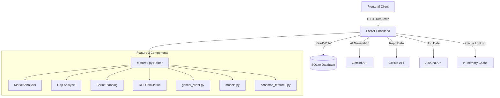

# Design Document: Feature 3 Skill Arbitrage Hardening

## Overview

This design document specifies the technical implementation for six enhancements to the existing Feature 3 Skill Arbitrage system. The enhancements add AI learning path persistence, composite full-run endpoint, Gemini-powered market commentary, salary currency support, market snapshot caching, and trending skills analysis. These improvements build upon the existing Feature3 market analysis, gap detection, and sprint planning infrastructure.

### Design Goals

1. **Persistence**: Store Gemini AI learning paths in the database for retrieval without re-computation
2. **Simplification**: Provide a single endpoint for the complete analysis workflow
3. **Market Insights**: Generate natural language market commentary using Gemini
4. **Localization**: Support multiple currencies for salary data
5. **Performance**: Cache market snapshots to reduce external API calls
6. **Discovery**: Surface trending skills across all market analyses
7. **Backward Compatibility**: Maintain existing API contracts while adding new capabilities

### Key Design Decisions

- **Database-First Approach**: New fields (salary_currency, market_commentary_json) are added to existing models
- **Caching Strategy**: In-memory LRU cache with 6-hour TTL for market snapshots
- **Composite Endpoint**: Full-run endpoint orchestrates existing analysis functions
- **Currency Conversion**: Real-time exchange rates from external API with fallback to static rates
- **Trending Analysis**: SQL aggregation over recent market snapshots

## Architecture

### System Context



### Component Responsibilities

#### 1. Database Layer (models.py)
- **Feature3MarketSnapshot**: Extended with `salary_currency` and `market_commentary_json`
- **Feature3GapSnapshot**: Already has `ai_learning_path_json` from Chunk 1
- **Migration Script**: Adds new columns with indexes and default values

#### 2. API Layer (api/feature3.py)
- **Existing Endpoints**: Enhanced to include new fields in responses
- **New Endpoints**:
  - `POST /api/feature3/full-run`: Composite endpoint for complete analysis
  - `GET /api/feature3/trending-skills`: Top 10 rising skills

#### 3. Caching Layer (api/feature3.py)
- **MarketCache**: In-memory LRU cache with 6-hour TTL
- **Cache Key**: (target_role, region, salary_currency)
- **Thread Safety**: Lock-based synchronization

#### 4. AI Client (analysis/gemini_client.py)
- **Market Commentary**: Natural language market insights
- **Learning Path**: Structured learning recommendations (already implemented in Chunk 1)

## Data Models

### Database Schema Extensions

#### Feature3MarketSnapshot Model Changes

```python
class Feature3MarketSnapshot(SQLModel, table=True):
    # ... existing fields ...
    
    # NEW FIELDS
    salary_currency: str = Field(
        default="USD",
        index=True,
        description="Currency for salary data: USD|PKR|GBP"
    )
    market_commentary_json: str = Field(
        default="{}",
        description="Gemini-generated market insights"
    )
```

#### Migration Script Structure

```python
# migrate_feature3_hardening.py

def migrate_feature3_hardening(db_path: str = "Backend/data/career_os.db"):
    """
    Idempotent migration to add salary_currency and market_commentary_json fields.
    """
    conn = sqlite3.connect(db_path)
    cursor = conn.cursor()
    
    # Check if columns already exist
    cursor.execute("PRAGMA table_info(feature3marketsnapshot)")
    columns = {row[1] for row in cursor.fetchall()}
    
    # Add salary_currency column
    if "salary_currency" not in columns:
        cursor.execute("""
            ALTER TABLE feature3marketsnapshot 
            ADD COLUMN salary_currency TEXT NOT NULL DEFAULT 'USD'
        """)
    
    # Add market_commentary_json column
    if "market_commentary_json" not in columns:
        cursor.execute("""
            ALTER TABLE feature3marketsnapshot 
            ADD COLUMN market_commentary_json TEXT NOT NULL DEFAULT '{}'
        """)
    
    # Create indexes
    cursor.execute("""
        CREATE INDEX IF NOT EXISTS idx_feature3_salary_currency 
        ON feature3marketsnapshot(salary_currency)
    """)
    
    conn.commit()
    conn.close()
```

### Request/Response Schemas

#### Enhanced Market Snapshot Request
```python
class Feature3MarketSnapshotRequest(BaseModel):
    # ... existing fields ...
    salary_currency: str = Field(default="USD", pattern="^(USD|PKR|GBP)$")
```

#### Enhanced Market Snapshot Response
```python
class Feature3MarketSnapshotResponse(BaseModel):
    # ... existing fields ...
    salary_currency: str
    market_commentary: str = ""
```

#### Full-Run Request
```python
class Feature3FullRunRequest(BaseModel):
    candidate_id: str
    target_role: str
    region: str
    remote_only: bool = False
    current_skills: List[str]
    salary_currency: str = Field(default="USD", pattern="^(USD|PKR|GBP)$")
    primary_skill_for_sprint: Optional[str] = None
```

#### Full-Run Response
```python
class Feature3FullRunResponse(BaseModel):
    market_snapshot: Feature3MarketSnapshotResponse
    gap_snapshot: Feature3GapSnapshotResponse
    skill_sprint: Feature3SkillSprintResponse
    roi_report: Feature3RoiReportResponse
    execution_time_seconds: float
```

#### Trending Skills Response
```python
class Feature3TrendingSkillItem(BaseModel):
    skill_name: str
    job_count: int
    growth_percentage: float
    average_salary: float
    currency: str

class Feature3TrendingSkillsResponse(BaseModel):
    trending_skills: List[Feature3TrendingSkillItem]
    analysis_period_days: int
    snapshot_count: int
```

## Implementation Details

### 1. Market Snapshot Caching

```python
from collections import OrderedDict
from datetime import datetime, timedelta, timezone
import threading

class MarketCache:
    def __init__(self, max_size: int = 50, ttl_hours: int = 6):
        self.cache: OrderedDict = OrderedDict()
        self.max_size = max_size
        self.ttl = timedelta(hours=ttl_hours)
        self.lock = threading.Lock()
    
    def get(self, key: tuple) -> Optional[Dict[str, Any]]:
        with self.lock:
            if key in self.cache:
                entry, timestamp = self.cache[key]
                if datetime.now(timezone.utc) - timestamp < self.ttl:
                    # Move to end (most recently used)
                    self.cache.move_to_end(key)
                    logger.info(f"Cache HIT: {key}")
                    return entry
                else:
                    # Expired
                    del self.cache[key]
                    logger.info(f"Cache EXPIRED: {key}")
            logger.info(f"Cache MISS: {key}")
            return None
    
    def set(self, key: tuple, value: Dict[str, Any]) -> None:
        with self.lock:
            if len(self.cache) >= self.max_size:
                # Evict least recently used
                evicted_key = next(iter(self.cache))
                del self.cache[evicted_key]
                logger.info(f"Cache EVICT: {evicted_key}")
            
            self.cache[key] = (value, datetime.now(timezone.utc))
            logger.info(f"Cache SET: {key}")

# Global cache instance
_market_cache = MarketCache()
```

### 2. Currency Conversion

```python
def _convert_salary(amount_usd: float, target_currency: str) -> float:
    """Convert USD salary to target currency."""
    if target_currency == "USD":
        return amount_usd
    
    # Static fallback rates (updated periodically)
    FALLBACK_RATES = {
        "PKR": 278.5,  # 1 USD = 278.5 PKR
        "GBP": 0.79,   # 1 USD = 0.79 GBP
    }
    
    # TODO: Integrate with live exchange rate API (e.g., exchangerate-api.com)
    # For MVP, use static rates
    rate = FALLBACK_RATES.get(target_currency, 1.0)
    return amount_usd * rate
```

### 3. Gemini Market Commentary

```python
def _generate_market_commentary(
    target_role: str,
    region: str,
    job_count: int,
    avg_salary: float,
    currency: str,
    top_skills: List[str]
) -> str:
    """Generate natural language market commentary using Gemini."""
    if not gemini_client.is_available():
        # Fallback heuristic commentary
        return (
            f"{target_role} market in {region}: {job_count} jobs found. "
            f"Average salary: {avg_salary:.0f} {currency}. "
            f"Top skills: {', '.join(top_skills[:3])}."
        )
    
    prompt = (
        f"You are a career market analyst. Summarize this job market data in 3-5 sentences:\n\n"
        f"Role: {target_role}\n"
        f"Region: {region}\n"
        f"Job postings: {job_count}\n"
        f"Average salary: {avg_salary:.0f} {currency}\n"
        f"Top required skills: {', '.join(top_skills[:5])}\n\n"
        "Provide insights on:\n"
        "1. Market demand (high/moderate/low)\n"
        "2. Salary competitiveness\n"
        "3. Key skill requirements\n"
        "4. Opportunities for candidates\n"
        "Keep it concise and actionable."
    )
    
    commentary = gemini_client.generate(prompt, temperature=0.3, max_tokens=256)
    return commentary.strip() if commentary else ""
```

### 4. Full-Run Composite Endpoint

```python
@router.post("/full-run", response_model=Feature3FullRunResponse)
def full_run_analysis(
    req: Feature3FullRunRequest,
    session: Session = Depends(get_session)
):
    """
    Execute complete skill arbitrage analysis:
    1. Market snapshot
    2. Gap analysis
    3. Skill sprint
    4. ROI report
    """
    start_time = time.time()
    
    try:
        # Step 1: Market Analysis
        market_req = Feature3MarketSnapshotRequest(
            candidate_id=req.candidate_id,
            target_role=req.target_role,
            region=req.region,
            remote_only=req.remote_only,
            salary_currency=req.salary_currency
        )
        market_response = create_market_snapshot(market_req, session)
        
        # Step 2: Gap Analysis
        gap_req = Feature3GapSnapshotRequest(
            candidate_id=req.candidate_id,
            market_snapshot_id=market_response.snapshot_id,
            current_skills=req.current_skills
        )
        gap_response = create_gap_snapshot(gap_req, session)
        
        # Step 3: Skill Sprint
        primary_skill = req.primary_skill_for_sprint or gap_response.top_gap_skills[0]
        sprint_req = Feature3SkillSprintRequest(
            candidate_id=req.candidate_id,
            gap_snapshot_id=gap_response.snapshot_id,
            target_role=req.target_role,
            primary_skill=primary_skill
        )
        sprint_response = create_skill_sprint(sprint_req, session)
        
        # Step 4: ROI Report
        roi_req = Feature3RoiReportRequest(
            candidate_id=req.candidate_id,
            market_snapshot_id=market_response.snapshot_id,
            gap_snapshot_id=gap_response.snapshot_id
        )
        roi_response = create_roi_report(roi_req, session)
        
        execution_time = time.time() - start_time
        
        return Feature3FullRunResponse(
            market_snapshot=market_response,
            gap_snapshot=gap_response,
            skill_sprint=sprint_response,
            roi_report=roi_response,
            execution_time_seconds=round(execution_time, 2)
        )
    
    except HTTPException:
        raise
    except Exception as e:
        logger.error(f"Full-run analysis failed: {e}", exc_info=True)
        raise HTTPException(
            status_code=500,
            detail=f"Full-run analysis failed at step: {str(e)}"
        )
```

### 5. Trending Skills Analysis

```python
@router.get("/trending-skills", response_model=Feature3TrendingSkillsResponse)
def get_trending_skills(
    days: int = 30,
    limit: int = 10,
    session: Session = Depends(get_session)
):
    """
    Analyze trending skills across recent market snapshots.
    """
    cutoff_date = datetime.now(timezone.utc) - timedelta(days=days)
    
    # Fetch recent market snapshots
    stmt = (
        select(Feature3MarketSnapshot)
        .where(Feature3MarketSnapshot.created_at >= cutoff_date)
        .order_by(Feature3MarketSnapshot.created_at.desc())
    )
    snapshots = list(session.exec(stmt).all())
    
    if not snapshots:
        return Feature3TrendingSkillsResponse(
            trending_skills=[],
            analysis_period_days=days,
            snapshot_count=0
        )
    
    # Aggregate skill counts across snapshots
    skill_stats: Dict[str, Dict[str, Any]] = {}
    
    for snapshot in snapshots:
        jobs = json.loads(snapshot.jobs_json)
        for job in jobs:
            for skill in job.get("required_skills", []):
                if skill not in skill_stats:
                    skill_stats[skill] = {
                        "count": 0,
                        "salaries": [],
                        "first_seen": snapshot.created_at,
                        "last_seen": snapshot.created_at
                    }
                skill_stats[skill]["count"] += 1
                if job.get("salary"):
                    skill_stats[skill]["salaries"].append(job["salary"])
                skill_stats[skill]["last_seen"] = max(
                    skill_stats[skill]["last_seen"],
                    snapshot.created_at
                )
    
    # Calculate growth and average salary
    trending = []
    for skill, stats in skill_stats.items():
        if stats["count"] < 3:  # Filter out rare skills
            continue
        
        # Simple growth heuristic: recent mentions vs total
        days_active = (stats["last_seen"] - stats["first_seen"]).days + 1
        growth_rate = (stats["count"] / days_active) * 100  # mentions per day
        
        avg_salary = (
            sum(stats["salaries"]) / len(stats["salaries"])
            if stats["salaries"]
            else 0.0
        )
        
        trending.append(
            Feature3TrendingSkillItem(
                skill_name=skill,
                job_count=stats["count"],
                growth_percentage=round(growth_rate, 2),
                average_salary=round(avg_salary, 2),
                currency="USD"  # TODO: Support multi-currency
            )
        )
    
    # Sort by growth rate and limit
    trending.sort(key=lambda x: x.growth_percentage, reverse=True)
    
    return Feature3TrendingSkillsResponse(
        trending_skills=trending[:limit],
        analysis_period_days=days,
        snapshot_count=len(snapshots)
    )
```

## Error Handling

### Error Categories

1. **External API Failures**: Gemini, GitHub, Adzuna
   - Return HTTP 502 with descriptive message
   - Log error details for monitoring

2. **Cache Errors**: Thread safety, eviction
   - Log warning and continue without cache
   - Degrade gracefully to direct API calls

3. **Currency Conversion Errors**: Invalid currency, rate unavailable
   - Fall back to USD
   - Log warning

4. **Full-Run Failures**: Any step fails
   - Return HTTP 500 with step indicator
   - Clean up partial database records

## Testing Strategy

1. **Unit Tests**:
   - Cache hit/miss/eviction logic
   - Currency conversion accuracy
   - Trending skills aggregation

2. **Integration Tests**:
   - Full-run endpoint with mocked external APIs
   - Market commentary generation
   - Database migration idempotency

3. **Performance Tests**:
   - Cache effectiveness (hit rate)
   - Full-run execution time
   - Trending skills query performance
